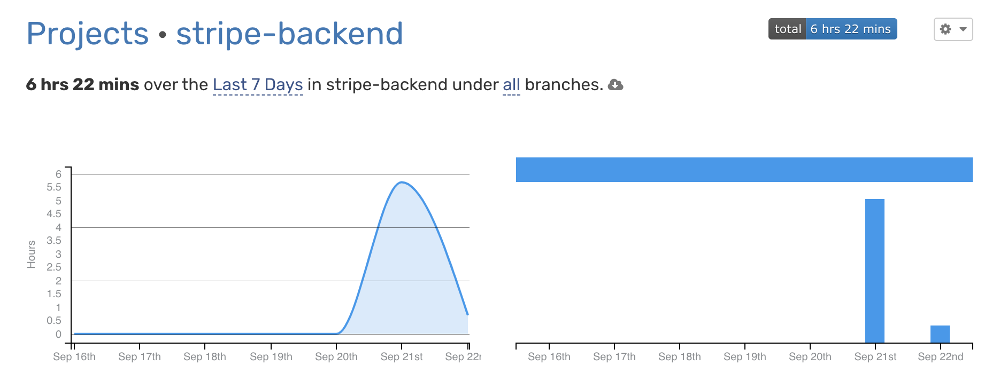

## Использование

Для запуска проекта Stripe Backend с использованием Docker Compose выполните следующие шаги:

1. Откройте окно терминала.

2. Перейдите в директорию `scripts`:

   ```sh
   cd scripts
   ```
3. Запустите скрипт local_start.sh:
    ```sh
    ./local_start.sh
    ```
    Этот скрипт будет использовать Docker Compose для сборки и запуска проекта Django и связанных сервисов.

Не забудьте предоставить права на выполнение скрипту local_start.sh, если это необходимо:

```sh
chmod +x local_start.sh

```
Также не забудьте файл .env в src:
```sh
cp .env.Example src/.env
```
Эта команда копирует файл .env.example в директорию src и одновременно переименовывает его в .env. Пожалуйста, убедитесь, что вы выполняете эту команду из корневой директории вашего проекта.

## Эндпоинты

API  для отображения шаблона со списком товаров, доступных для покупки
 - Method: GET

 - URL: http://0.0.0.0:8000/api/item/buy/
 - Server URL: http://134.122.75.14:8080/api/item/buy/

Возможность покупки большего количество item сделал без создания отдельной модели для корзины, а просто добавил корзину в шаблоне и сделал возможность добавлять item в корзину и удалять из нее. Также была мысль сделать корзину через сессию но думаю на продакшене это очень хорошая идея, а так как это тестовое задание решил ее не делать.
Думаю изучу полностью библиотеку stripe в будущем если будет необходимость, а пока ознокомился с ней и сделал простой пример. Немного был занят в последнее время поэтому не успел сделать все что хотел, но в целом думаю что справился с заданием. Спасибо за внимание.

Потраченное время: 6 часов




